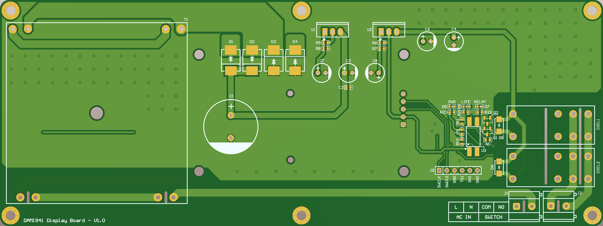

##  LCD Display - DAC DAM1941

The hardware is built on STM32F042F4P6 microcontroller and 2.42" OLED screen to control DAC DAM1941 with the following functions:
- Display information
- Control modes according to user preferences

### Simple Tasker Kernel 
The firmware of system is programmed with "simple tasker kernel". An event-driven base system in embedded programming.

### Hardware
Hardware includes:
- STM32F042F4P6
- LCD OLED 2.42" I2C interface
- Buttons
- Buzzer
- Relay (to control the power)

### References
| Topic | Link |
| ------ | ------ |
| Tutorial of "STK"| https://github.com/NgoThanhNha/template-stk-stm32f030